# ◈ skill-to-webpage

<p align="center"></p>
<p align="center"><strong>等等，我的 Agent 到底在干嘛？</strong><br><sub>看懂 SKILL.md <b>不是我的活儿</b>。但我还是想知道它给我的 Agent 灌了啥<b>迷魂汤</b>。</sub></p>
<div align="center">
  <a href="LICENSE"></a>
  <a href="https://arxiv.org/abs/2606.06893"></a>
</div>

----

事情是这样的：

我让 Agent 装了一个 SKILL，Agent 说「已加载，随时待命」。我点点头，觉得一切尽在掌控。直到它开始莫名其妙翻车……

所以到底哪里出了问题？是不是我们的任务流程不一样？<font color="gray">（导师让我上机后先调电子宠物给机魂师叔磕头，但是 SKILL 没磕？🤯 ）</font>

我翻开它的 SKILL.md ——

>「根据用户输入判断意图，如果意图为 A 则跳到 Step 3，否则继续 Step 2……」
>
>「Step 2 执行后若返回错误，回到 Step 1 重试，最多三次……」
>
>「Step 3 完成后根据结果选择 Step 4a 或 4b，注意 4b 之后要回到 Step 2 做二次校验……」

我从头读到尾，又从尾读到头。

脑子里只剩一句话：「所以……**你到底叫我的 Agent 干了啥？！？！？**」

我知道 Skill 肯定能跑，大概率能完成任务，但我不确定它是不是按我想象的方式在跑。出了问题，我也不知道该从哪一步开始查 …… 🫠

谁爱读谁读，反正我不读了 🤷 

我只想看到一张图 ```先走哪、后走哪、什么时候分叉、卡住了怎么办``` 一眼就能看清楚的那种。

----

然后我就做了这个：

skill-to-webpage 把 SKILL 变成一张能交互的 workflow 网页。

一眼就能看到从头到尾整个流程长什么样；点进任意一个节点，子流程自动展开，每一步怎么推进、哪里分叉、哪里回头，全摊开在面前。多个 skill 放在一起,还能看到它们之间谁交棒给谁。

哪里不会点哪里 —— 页面上的每一句话都能回查到 `SKILL.md` 的具体位置。

<p align="center">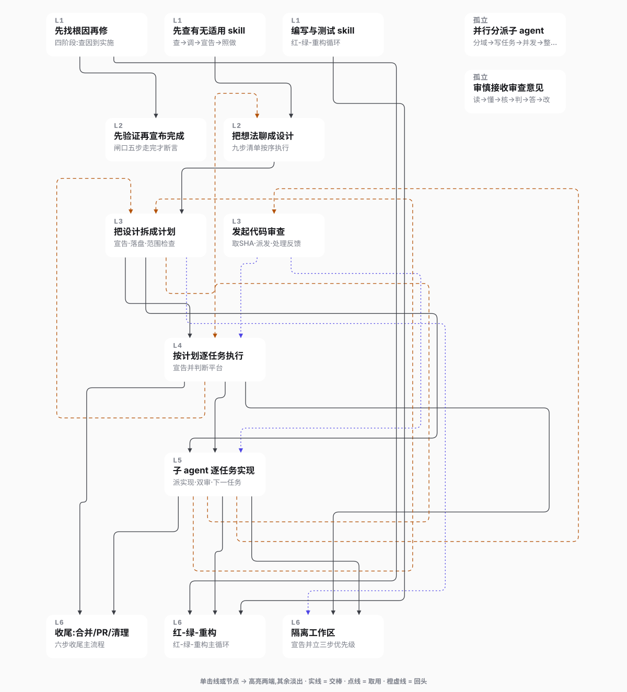</p>
<p align="center"><sub>Superpowers 全家桶（14 个 skill）的调用关系。实线是前传，点线是取用工具，橙色虚线链接迭代的起终点。点击任意一条线或节点，关联行为自动高亮 —— 看谁调了谁，一目了然。</sub></p>

## 快速开始

### 安装
方式一：使用 npx 直接安装：
```bash
npx skills add https://github.com/Q1ngSong/skill-to-webpage --skill skill-to-webpage
npx skills add https://github.com/Q1ngSong/skill-to-webpage --skill rwsa-lite
```

方式二：让 Agent 代劳
打开你正在用的 agent，告诉他：
```bash
帮我安装这个 skill：https://github.com/Q1ngSong/skill-to-webpage/tree/main/skills/skill-to-webpage 以及 https://github.com/Q1ngSong/skill-to-webpage/tree/main/skills/rwsa-lite
```

方式三：或者手动安装这个 Skill，先 git 克隆仓库：
```bash
git clone https://github.com/Q1ngSong/skill-to-webpage.git
```
再告诉 Agent 
```bash
安装其中的 skills/skill-to-webpage 以及 skills/rwsa-lite
```

### 立即使用
不需要记命令，只需要在对话里说一句话，Agent 会接管整个流程(拆解、抽语义、合并、渲染、验证):

1. 只用静态解析([静态解析案例](examples/1-static-find-skills/find-skills-workflow.html))，在生成 html 时会由 Agent 临场补语义：
```
 可视化这个 skill:/path/to/some-skill
```

2. 使用你的解析 skill([自定义解析 skill 解析案例](examples/2-parser-rwsa-lite-find-skills/find-skills-workflow.html)，推荐装上 rwsa-lite 作为一种基础的 LLM 解析方案)：
```
使用 /path/to/my-parser-skill 分析并可视化 /path/to/some-skill
```

3. 解析一组 skill([SuperPowers 解析案例(14 个 skill 的组合)](examples/3-bundle-superpowers/superpowers-workflow.html))：
```
可视化这组 skill:/path/to/skills-group
```

<details>
<summary>不走 Agent,手动跑命令(在仓库根目录执行;装成技能后把前缀换成技能目录)</summary>

```bash
# ① 静态拆解(零 LLM):任何有 SKILL.md 的目录都行
python3 skills/skill-to-webpage/scripts/extract.py <skill目录> --output-dir output/<skill名> --name static

# ② 解析器产出 output/<skill名>/<解析器名>/semantics.json 之后,逐条校验
python3 skills/skill-to-webpage/scripts/validate_semantics.py output/<skill名>/<解析器名> --static output/<skill名>/static --skill-dir <skill目录>

# ③ 合并(多个解析器时冲突写进 merged/merge-report.md)
python3 skills/skill-to-webpage/scripts/merge_semantics.py output/<skill名> --parsers <解析器名…> --skill-dir <skill目录>

# ④ 渲染 + 验证。可出多版:merged / static / <解析器名>,各进自己的文件夹,根目录放 merged 版
python3 skills/skill-to-webpage/scripts/render.py output/<skill名> --variants merged static <解析器名> --skill-dir <skill目录> [--theme docs] [--overrides output/<skill名>/overrides.json]
node skills/skill-to-webpage/scripts/verify-page.js output/<skill名>/<skill名>-workflow.html
```

一组 skill(组目录下每个子目录一个 `SKILL.md`):

```bash
# ①' 组级静态拆解:逐成员 static/ + 跨引用事实表 + bundle.json
python3 skills/skill-to-webpage/scripts/extract_bundle.py <组目录> --output-dir output/<组名>

# ②③' 每个成员照常校验与合并,多带 --bundle(这样才允许 <skill>:nXX 这种跨 skill 端点)
python3 skills/skill-to-webpage/scripts/validate_semantics.py output/<组名>/<成员>/<解析器名> --static output/<组名>/<成员>/static \
        --skill-dir <组目录>/<成员> --bundle output/<组名>/bundle.json
python3 skills/skill-to-webpage/scripts/merge_semantics.py output/<组名>/<成员> --parsers <解析器名…> \
        --skill-dir <组目录>/<成员> --bundle output/<组名>/bundle.json

# ④' 所有成员都合并完之后,再把每个成员渲染一遍(成员页的跨 skill 入边是渲染时从兄弟目录取的,先渲染的看不到后合并的)
for m in $(python3 -c "import json;print(*[m['name'] for m in json.load(open('output/<组名>/bundle.json'))['members']])"); do
  python3 skills/skill-to-webpage/scripts/render.py "output/<组名>/$m" --skill-dir "<组目录>/$m" --variants merged static
done

# 最后出总览页并验证;不给 --overrides 时自动读 output/<组名>/overrides.json
python3 skills/skill-to-webpage/scripts/render_bundle.py output/<组名> [--theme docs]
node skills/skill-to-webpage/scripts/verify-page.js output/<组名>/<组名>-workflow.html
```

</details>

## 页面长什么样

### 流程图

页面顶部把节点按"触发条件 / 执行流程 / 支撑知识"分类（静态解析时按文档内容排序）。

<p align="center"></p>

### 子流程图

流程图中关键节点里的细节步骤形成细节流程图。蓝色弧是条件跳转，橙色弧表示重试/迭代环。

点击任意节点展开相关说明；点击任意线，它的关联的节点被聚焦高亮，其余则失焦。

<p align="center"></p>

### 出处

每块内容都带 `SKILL.md` 的行号。打开右上角的「显示出处」，每条语义断言旁边会展开它引用的原文。

<p align="center"></p>

### 追问

任何内容块右上角都有一个 `?`。输入问题后，页面可以把问题、所在节点和步骤、行号、涉及的依赖文件、知识库路径打包复制到剪贴板，贴给 Agent 就能接着深挖。

<p align="center"></p>

### 主题

四套内置主题（[简洁文档](skills/skill-to-webpage/templates/themes/docs.css)、[技术蓝图](skills/skill-to-webpage/templates/themes/blueprint.css)、[终端 IDE](skills/skill-to-webpage/templates/themes/ide.css)、[白板手绘](skills/skill-to-webpage/templates/themes/whiteboard.css)），右上角切换，记住上次的选择。

<p align="center"></p>

## 多个 skill 一起看

现在的功能动不动就跨好几个 SKILL，每个 SKILL 各管一摊，凑在一起又能互相调用、干更大的事。

问题是 —— 一个我都看不过来，几十个放在一起，是要我老命吗？🤯

但我们的图天生就是可以将不同 skill 的节点链接在一起的呀！因此我们进一步拓展了多 skill 联动功能，像做 CT 一样，跨 skill 扫描功能。

所以 `skill-to-webpage` 对多 SKILL 场景做了专门支持：给定一个目录，里面每个子目录是一个 SKILL。`skill-to-webpage` 会生成一张总览页，外加每个 SKILL 自己的专属页面（内含跨 SKILL 的调用节点，照样能联动）。

总览页分两层：

- **SKILL 级**：谁调了谁，一目了然。

- **节点级**：默认只显示主线节点和参与跨 SKILL 调用的节点，不把全部细节砸出来。想看全貌？点「全部展开」就行。

<p align="center"></p>

每个 SKILL 的独立页面也会跟着变 —— 子流程下方会多出一块「外部节点卡」，标清楚这一步依赖了哪个 SKILL 的什么节点、又兜兜转转去了哪个 SKILL。点一下，跨页跳转，直接定位到目标 SKILL 页面里的那个节点。

<p align="center"></p>

跨 SKILL 的边不是猜出来的。

`skill-to-webpage` 先用一个零 LLM 的扫描器，把「谁在第几行提到了谁」全部记成事实表（cross-refs.json），然后语义层声明的每一条跨 SKILL 边，必须能在事实表里找到对应依据，否则作废。保证你看到的每一条依赖关系，都能在原文里查到出处。

<p align="center">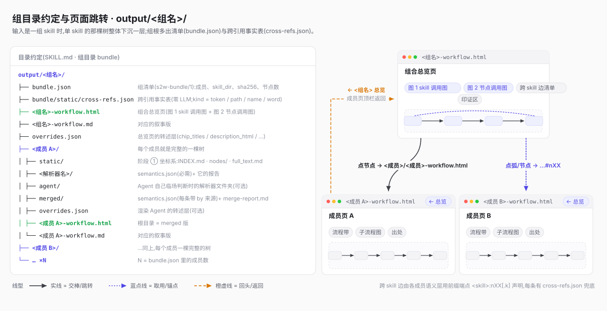</p>

## 它是怎么做到可信的

> **我凭什么信你？** 🤨

页面上的内容分两层，读的时候可以看一眼区别：

- **原文层**：脚本直接搬运的 —— 节点正文、行号、资源清单，全带行号标记，鼠标悬停就能看到对应位置。
- **转述层**：Agent 写的概括 —— 分组名、节点副标题、执行总纲、段首引语。它们是总结，不是原文引用；详情面板里的转述会标出处行号，导航层的概括不带锚点。页脚也有同样的说明。

这两层能分开，靠的是一条流水线：

1. **拆解**：不用 LLM，扫描围栏外的 H1–H6，跳过明确的单一文档包装标题，再把前三个有效层级映射为相对 L1 节点、L2 步骤和 L3 展示小节；原文即使从 H3/H4 开始或中间跳级，也会得到连续、可审计的坐标，并连同行号写入目录。
2. **语义**：解析器在目录上叠加分层、步骤类型、分支、回环、检查点等信息 —— 每加一条信息都必须带着出处（`source`）和原文引用（`quote`）。
3. **校验**：校验器拿着每条断言回原文核对，对不上就作废；文件级的整体问题（比如 SHA 对不上、行数异常、覆盖率不够）才会整体降级。

<p align="center">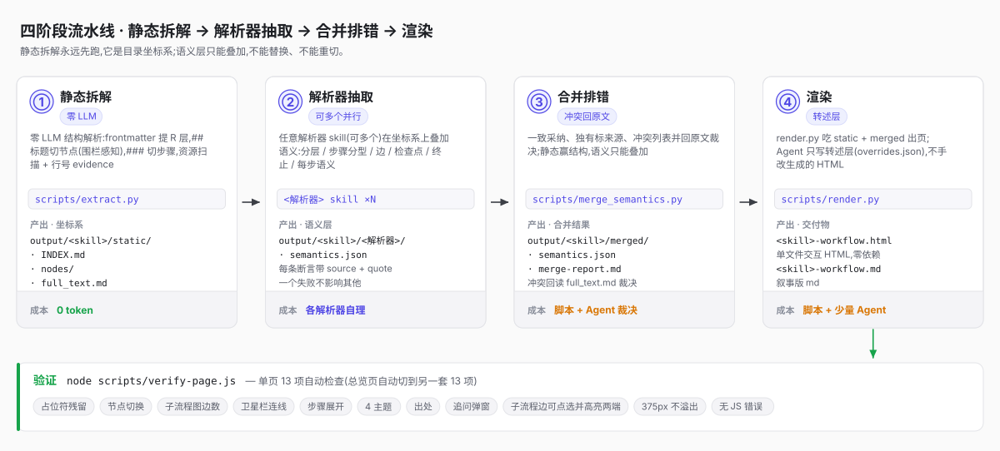</p>

<p align="center">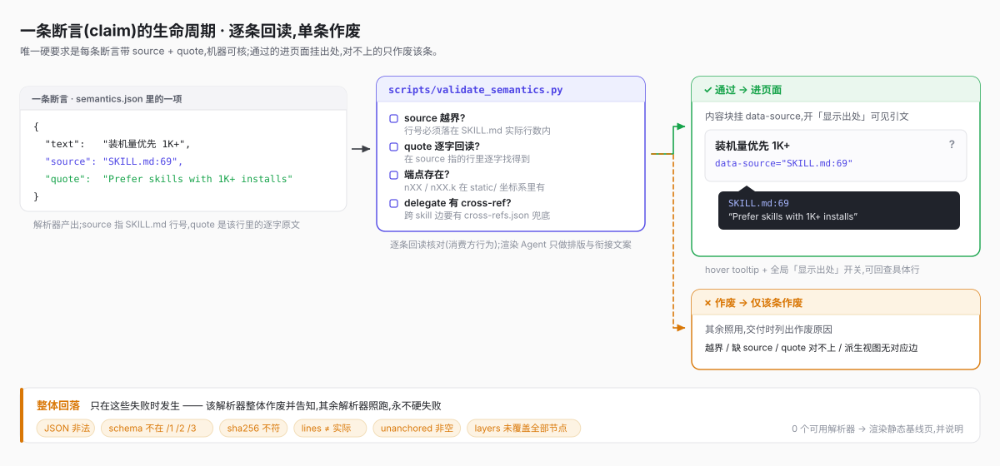</p>

还有个麻烦事：目录和真实流程经常对不上 —— 标题不一定代表流程节点，文本里可能藏着没写标题的隐含步骤，文档顺序也不等于执行顺序。

这些偏差不会去篡改目录，而是写进页面的「印证报告」里，直接告诉你哪里对不上、差在哪。

<p align="center">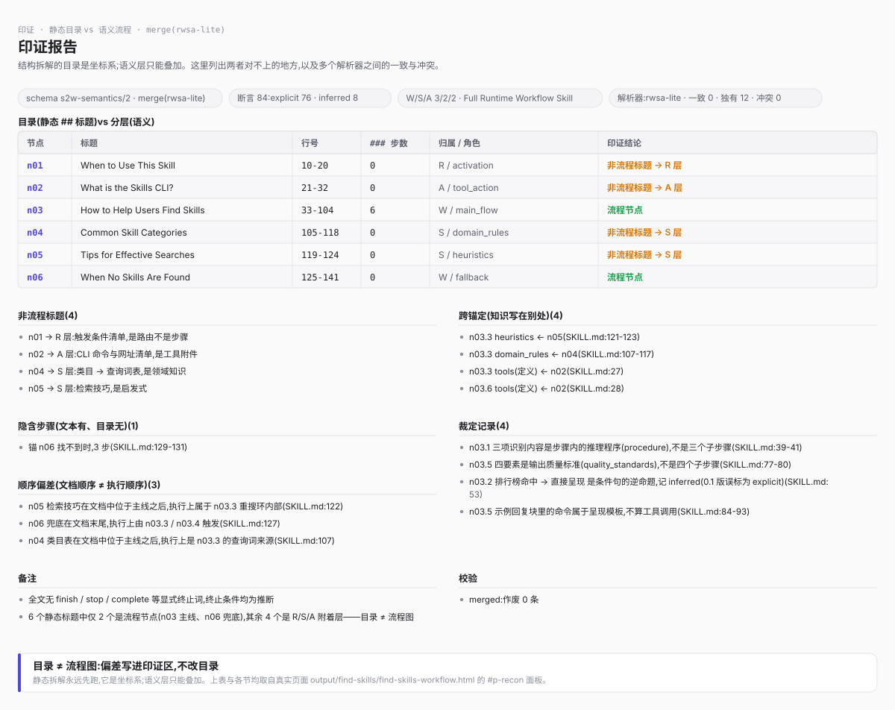</p>

## 写你自己的解析器

前面说的"转述层"是由解析器生成的 —— 你可以理解成：SKILL.md 拆成节点之后，谁来给这些节点"划重点"？

我们默认使用了静态（0 LLM）解析器，但是，现实生活中谁不想急头白脸地用自己调教的 Agent 自己划一划啊？

解析器不需要在这个项目里注册。它就是一个普通的 Skill，调用时告诉 Agent 路径或名字就行。<font color="gray">如果真的没有 skill 让 Agent 自己临场判断也算一个解析器。</font>

但是先别急，解析器设计有三项硬需求，使其能够和本项目对接整齐：
1. 读取 `output/<skill名>/static/` 目录里的静态解析结果；
2. 按协议 [semantics-contract.md](skills/skill-to-webpage/references/semantics-contract.md) 产出 `semantics.json`；
3. 遵守握手约定 [parser-protocol.md](skills/skill-to-webpage/references/parser-protocol.md)。

你可以换不同的解析器，甚至几个一起用，互相印证。

至于想要解析什么方向 —— 只关心安全约束也行，只关心工具调用也行，想全量做语义分层也行 —— 全看你想从 SKILL 里挖出什么信息。

举个例子：`examples/2-parser-rwsa-lite-find-skills/`  是用外部解析器 [`rwsa-lite`](skills/rwsa-lite) 跑出来的。

## 文件结构

```
skill-to-webpage/                 ← 仓库:README、配图、示例、测试
├── README.md · LICENSE · assets/ · examples/ · tests/ · package.json
└── skills/
    └── skill-to-webpage/         ← 技能本体:npx skills add 只装这个目录
        ├── SKILL.md              # Agent 的执行指令
        ├── templates/
        │   ├── base.html         # 单页骨架:布局、组件样式、交互
        │   ├── bundle.html       # 总览页骨架:两张图、清单、印证区
        │   ├── flow-lib.js       # 布线库(正交布线、轨道避让),渲染时内联进两个模板
        │   ├── components.md     # 组件范式与内容→组件的决策表
        │   └── themes/           # docs / blueprint / ide / whiteboard
        ├── references/
        │   ├── parser-protocol.md    # 解析器握手:输入、验收、合并规则
        │   └── semantics-contract.md # 语义数据格式(s2w-semantics/2,组合扩展 /3)
        └── scripts/
            ├── extract.py            # ① 静态拆解(零 LLM)
            ├── extract_bundle.py     # ①' 组级静态拆解 + 跨引用事实表
            ├── validate_semantics.py # ② 校验解析器产物
            ├── merge_semantics.py    # ③ 多解析器合并
            ├── render.py             # ④ 单页渲染
            ├── render_bundle.py      # ④' 总览页渲染
            ├── bundle_layout.py      # 总览页布局(分层、破环、排序)
            ├── s2w_common.py         # 共用读取与归一化
            └── verify-page.js        # Playwright 自动验证
```

## Roadmap

- [x] 零 LLM 静态拆解
- [x] 渲染模板与主题
- [x] 语义契约 `s2w-semantics/2` 与解析器协议
- [x] 多解析器合并与冲突裁决
- [x] 多 skill 组合:`s2w-semantics/3`、跨引用事实表、总览页
- [ ] 页面内直接得到 Agent 的回答
- [ ] 跨组索引页

## Citation

本项目的`rwsa-lite`参考自论文 *Workflow-to-Skill: Skill Creation via Routing-Workflow-Semantics-Attachments Decomposition*：

```bibtex
@article{zhang2026workflow,
  title={Workflow-to-Skill: Skill Creation via Routing-Workflow-Semantics-Attachments Decomposition},
  author={Zhang, Yuyang and Han, Xinyuan and Jiang, Xudong and Wang, Run},
  journal={arXiv preprint arXiv:2606.06893},
  year={2026}
}
```
